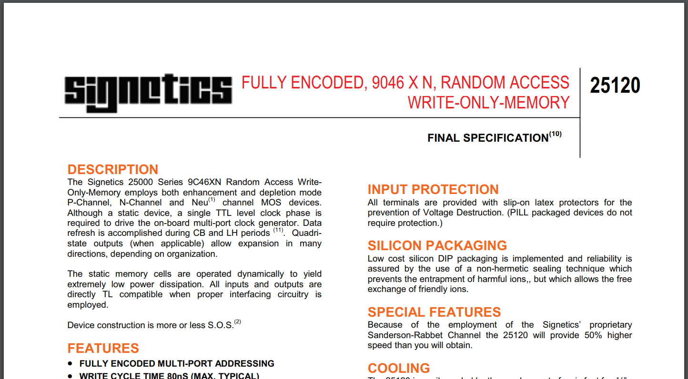

# So..

..probably not all of you have kids..

# But..

..you might recognize something like this:

# 
## My spaceship is faster!

# 
## No! My spaceship is faster!

# 
## But my spaceship is faster still!

# 
## And my spaceship is faster still still!

# 
## My spaceship is always one hundred faster than yours!

# 
## And my spaceship is always one thousand million faster than yours!

# 
Ad infinitum 

# However!
This is the perfect moment to bring up the topic of recursive functions!

# Definition

> A recursive function, in logic and mathematics, is a type of function or expression predicating some concept or property of one or more variables, which is specified by a procedure that yields values or instances of that function by repeatedly applying a given relation or routine operation to known values of the function.

[Encyclopaedia Britannica](https://www.britannica.com/science/recursive-function)

# Coding time!

#
## Recursion
Square one

```c++
long spaceship_speed(long start_speed) {
  return spaceship_speed(++start_speed);
}


int main() {
  return spaceship_speed(1);
}
```

#
## Recursion
All the hip kids use lambdas

```c++
int main() {
  auto spaceship_speed =
    [&](long start_speed) {
      return spaceship_speed(++start_speed);
    };

  return spaceship_speed(1);
}
```

#
## Recursion
Whoops. C++17 to the rescue!

```c++
#include <functional>


int main() {
  std::function<long(long)> spaceship_speed =
    [&](long start_speed) {
      return spaceship_speed(++start_speed);
    };

  return spaceship_speed(1);
}
```

#
## Recursion
Even hipper kids do compile-time code

```c++
constexpr long spaceship_speed(long start_speed) {
  return spaceship_speed(++start_speed);
}

int main() {
  return spaceship_speed(1);
}
```

#
## Recursion
Even hipper kids do compile-time code

```c++
constexpr long spaceship_speed(long start_speed) {
  return spaceship_speed(++start_speed);
}

int main() {
  return spaceship_speed(1);
}
```
..or do they?

#
## Recursion
Uh-oh..

```c++
constexpr long spaceship_speed(long start_speed) {
  return spaceship_speed(++start_speed);
}

template<long VALUE>
struct OmgWtf { long value_ = VALUE; };

int main() {
  return OmgWtf<spaceship_speed(1)>{}.value_;
}
```

#
## Recursion
Oh dear

```c++
constexpr long spaceship_speed(long start_speed) {
  return spaceship_speed(++start_speed);
}

template<typename TYPE, TYPE VALUE>
struct OmgWtf { TYPE value_ = VALUE; };

int main() {
  constexpr auto value = spaceship_speed(1);
  return OmgWtf<decltype(value), value>{}.value_;
}
```

#
## Recursion
Again, all the hip kids use lambdas

```c++
constexpr long spaceship_speed(long start_speed) {
  return spaceship_speed(++start_speed);
}

template<typename TYPE, TYPE VALUE>
struct OmgWtf { TYPE value_ = VALUE; };

int main() {
  const auto get_value = []() {
    constexpr auto value = spaceship_speed(1);
    return OmgWtf<decltype(value), value>{}.value_;
  };

  return get_value();
}
```

#
## Recursion
IIFE to complete the mess

```c++
constexpr long spaceship_speed(long start_speed) {
  return spaceship_speed(++start_speed);
}

template<typename TYPE, TYPE VALUE>
struct OmgWtf { TYPE value_ = VALUE; };

int main() {
  return [] {
      constexpr auto value = spaceship_speed(1);
      return OmgWtf<decltype(value), value>{}.value_;
    }();
}
```

# 

# Identifying recruitment opportunities

# Multi-threading issues
Multiple children == multithreading issues

#
## Toy-sharing hell
Toys are resources; races and deadlocks occur.

#
## Toy-sharing hell
Toys are resources; races and deadlocks occur.

All the time.

#
## Another one: resource overcommitment
Holidays, birthday parties anyone?

#
## Another one: resource overcommitment
Holidays, birthday parties anyone?

I guess you get it by now.

# One last example

#
Hey, would you please clean up your toys?

# 
## ...

#
Hey, would you please clean up your toys?

# 
## ...

#
HEY, now will you please clean up your toys?

# 
## ...

# CLEAN UP YOUR TOYS!

# 
## ...
Sigh.

#


#
Thanks!
